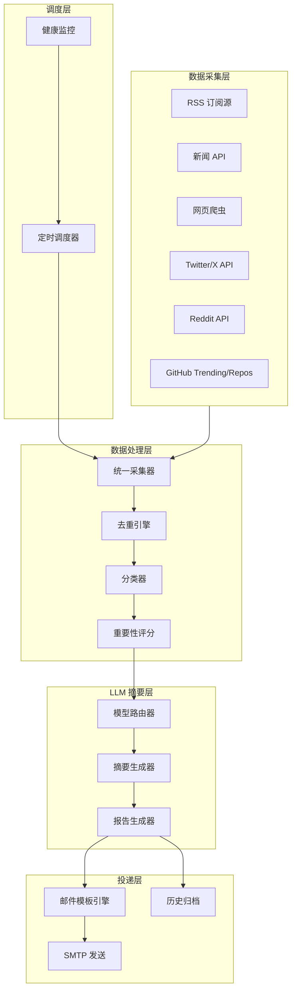

# AI Daily Digest Agent - 产品需求文档 (PRD)

## 1. 项目概述

**产品名称**: AI Daily Digest Agent

**一句话描述**: 一个全自动的 AI 新闻聚合 Agent，每日从多个信息源采集 AI 领域资讯，利用 LLM 进行智能筛选、分类和摘要，生成精美的日报邮件。

**核心价值**: 帮助 AI 从业者/爱好者节省每天 1-2 小时的信息检索时间，不错过任何重要动态。

---

## 2. 系统架构




---

## 3. 功能模块详解

### 3.1 数据采集层 (Collectors)

每个数据源实现统一的 `BaseCollector` 接口，便于扩展。


| 模块  | 数据源 | 实现方式 |
| --- | --- | ---- |


- **RSS Collector**: 订阅 arXiv (cs.AI, cs.LG, cs.CL), TechCrunch AI, MIT Tech Review, The Verge AI, VentureBeat AI 等，使用 `feedparser` 解析
- **News API Collector**: 通过 NewsAPI.org 按关键词 (AI, LLM, machine learning, deep learning) 检索，免费版 100 次/天够用
- **Web Scraper**: 针对特定站点 (Hacker News, 机器之心, 量子位) 使用 `httpx` + `BeautifulSoup` 爬取
- **Twitter/X Collector**: 通过 Twitter API v2 追踪 AI KOL (如 @ylecun, @kaborojevic, @AndrewYNg 等) 动态
- **Reddit Collector**: 通过 Reddit API (PRAW) 获取 r/MachineLearning, r/artificial, r/LocalLLaMA 的热门帖子
- **GitHub Collector**: 采集 GitHub 上 AI 领域优秀项目，包含三个维度:
  - **Trending 热榜**: 爬取 GitHub Trending 页面，筛选 AI/ML 相关语言 (Python, Jupyter Notebook) 和 topic (machine-learning, deep-learning, llm, ai 等) 的日榜/周榜项目
  - **明星仓库动态追踪**: 预配置一批核心 AI 仓库 (如 langchain, vllm, ollama, transformers, llama.cpp, open-webui 等)，通过 GitHub API 监控其新 Release、重大 Issue 和 PR 动态
  - **新星项目发现**: 通过 GitHub Search API 按 `created:>YYYY-MM-DD stars:>50 topic:ai` 等条件发现近期新创建且快速增长的 AI 项目
  - 使用 GitHub REST API (通过 `httpx`)，可选配合 `PyGithub` 库简化操作；需要 GitHub Personal Access Token (免费，5000 次/小时)

每条采集到的新闻统一为 `NewsItem` 数据结构:

```python
@dataclass
class NewsItem:
    title: str
    url: str
    source: str          # 来源标识
    source_type: str     # rss/api/scraper/twitter/reddit/github
    content: str         # 原文内容或摘要
    published_at: datetime
    author: str | None
    tags: list[str]
    raw_score: float     # 源端热度分数 (点赞/转发等)
    fingerprint: str     # 用于去重的内容指纹
```

### 3.2 数据处理层 (Processing)

- **去重引擎**: 基于 URL 精确去重 + SimHash/MinHash 内容相似度去重 (阈值 0.85)，防止同一新闻多源重复
- **智能分类**: 将新闻自动分为以下类别:
  - **论文与研究**: 最新学术论文、研究突破
  - **产品与发布**: 新产品、模型发布、版本更新
  - **行业动态**: 融资、并购、政策法规
  - **教程与观点**: 技术博客、专家评论
  - **开源项目**: 新开源项目、热门 repo 更新
- **重要性评分**: 综合考量因素:
  - 来源权威度 (权重 0.3)
  - 社交热度 - 点赞/转发/评论数 (权重 0.25)
  - 时效性 (权重 0.2)
  - 内容相关度 (权重 0.15)
  - 多源覆盖度 - 被多个源报道 (权重 0.1)

### 3.3 LLM 摘要层 (Summarization)

- **模型路由器**: 采用插件式注册机制，支持灵活切换和动态扩展:
  - **当前启用**:
    - 通义千问 Qwen (通过阿里云 DashScope API，兼容 OpenAI 接口格式)
    - 智谱 GLM (通过智谱开放平台 API，兼容 OpenAI 接口格式)
  - **可扩展**: 预留通用 OpenAI 兼容接口适配器，后续添加新模型只需在配置文件 `llm_providers.yaml` 中新增一段配置即可，无需改代码
  - **切换策略**: 支持三种模式:
    - `primary`: 只用主模型（默认千问）
    - `fallback`: 主模型失败时自动切换备用模型（智谱）
    - `round_robin`: 轮流使用，分摊用量和费用
  - 统一通过 OpenAI 兼容接口调用，所有国产模型（千问、智谱、DeepSeek、月之暗面等）均支持此格式，后续扩展零成本
- **摘要生成策略**:
  - 每条新闻生成 2-3 句中文摘要
  - Top 5 重要新闻生成详细分析 (100-200 字)
  - 生成每日 AI 领域趋势总结 (一段话)
  - 可选: 英文新闻自动翻译为中文
- **Prompt 工程**: 使用结构化 prompt 模板，确保输出格式稳定:

```python
SUMMARY_PROMPT = """
你是一位专业的 AI 领域新闻编辑。请对以下新闻进行摘要：

标题：{title}
来源：{source}
原文：{content}

要求：
1. 用中文输出 2-3 句话的摘要
2. 突出技术要点和行业影响
3. 保持客观中立的语气
4. 如有关键数据/指标，务必保留
"""
```

### 3.4 报告生成与邮件投递

- **报告结构**:
  - 标题: "AI 日报 - {日期}"
  - 今日概览: 一段话总结当天 AI 领域整体动态
  - TOP 5 重要新闻 (含详细分析)
  - 分类新闻列表 (每类 3-5 条，含简短摘要)
  - 值得关注的论文 (arXiv 精选)
  - 数据统计: 今日采集 N 条，筛选 M 条
- **邮件模板**: 使用 Jinja2 生成响应式 HTML 邮件，支持深色/浅色主题
- **发送方式**: 通过 SMTP (Gmail / 企业邮箱 / SendGrid) 发送，支持配置多个收件人
- **历史归档**: 每份报告同时保存为 Markdown 文件到本地 `archive/` 目录

### 3.5 调度与监控

- 使用 `APScheduler` 实现定时调度，默认每日上午 10:00 (Asia/Shanghai) 执行
- 错误重试: 采集失败自动重试 3 次，间隔指数递增
- 日志记录: 使用 `loguru` 记录全链路日志
- 健康检查: 可选的简单 Web 接口 (`/health`) 用于监控

---

## 4. 技术选型

- **语言**: Python 3.11+
- **HTTP 客户端**: `httpx` (异步支持)
- **RSS 解析**: `feedparser`
- **网页解析**: `beautifulsoup4` + `lxml`
- **Reddit**: `praw`
- **Twitter**: `tweepy`
- **LLM 调用**: `openai` SDK (通义千问、智谱均兼容 OpenAI 接口格式，统一用一个 SDK)
- **邮件模板**: `jinja2`
- **邮件发送**: `smtplib` (标准库) 或 `python-emails`
- **定时调度**: `apscheduler`
- **数据存储**: `SQLite` (轻量级，存储历史记录和去重信息)
- **配置管理**: `pydantic-settings` + `.env` 文件
- **日志**: `loguru`
- **去重**: `datasketch` (MinHash)

---

## 5. 项目结构

```
ai-daily-digest/
  config/
    settings.py          # Pydantic Settings 配置
    sources.yaml         # 数据源配置 (RSS 链接、关键词等)
    llm_providers.yaml   # LLM 供应商注册表 (可扩展)
    prompts/             # LLM prompt 模板
  collectors/
    base.py              # BaseCollector 抽象类
    rss_collector.py
    newsapi_collector.py
    scraper_collector.py
    twitter_collector.py
    reddit_collector.py
    github_collector.py  # GitHub 热门项目采集
  processing/
    dedup.py             # 去重引擎
    classifier.py        # 新闻分类
    scorer.py            # 重要性评分
  llm/
    router.py            # LLM 模型路由
    summarizer.py        # 摘要生成
    report_generator.py  # 日报生成
  delivery/
    email_sender.py      # 邮件发送
    templates/           # Jinja2 HTML 模板
    archive.py           # 历史归档
  storage/
    database.py          # SQLite 操作
    models.py            # 数据模型
  scheduler/
    jobs.py              # 定时任务定义
    monitor.py           # 健康监控
  main.py                # 入口
  requirements.txt
  .env.example           # 环境变量模板
  README.md
```

---

## 6. 部署方案推荐

考虑到成本和易用性，推荐以下方案 (按优先级排序):

1. **GitHub Actions (推荐首选)**: 零成本，配置 cron schedule 每日触发，无需维护服务器。免费额度 2000 分钟/月完全够用。
2. **本地 Windows 计划任务**: 利用 Windows Task Scheduler 在本地定时运行，适合开发调试阶段。
3. **云服务器**: 如需要更高可靠性，使用最低配 AWS EC2 / 腾讯云轻量，月费约 30-50 元。

---

## 7. 配置示例

```yaml
# ============================================
# .env - 主配置文件
# ============================================

# ---------- LLM 模型配置 ----------
# 切换策略: primary(只用主模型) / fallback(失败切换备用) / round_robin(轮流使用)
LLM_STRATEGY=fallback
LLM_PRIMARY_PROVIDER=qwen     # 主模型: qwen(千问) / zhipu(智谱)

# 通义千问 (阿里云 DashScope)
QWEN_API_KEY=sk-xxx            # 在 dashscope.console.aliyun.com 获取
QWEN_MODEL=qwen-plus           # 可选: qwen-turbo / qwen-plus / qwen-max
QWEN_BASE_URL=https://dashscope.aliyuncs.com/compatible-mode/v1

# 智谱 GLM
ZHIPU_API_KEY=xxx.xxx          # 在 open.bigmodel.cn 获取
ZHIPU_MODEL=glm-4-flash        # 可选: glm-4-flash(免费) / glm-4-plus / glm-4
ZHIPU_BASE_URL=https://open.bigmodel.cn/api/paas/v4

# (后续扩展示例 - 取消注释即可启用)
# DEEPSEEK_API_KEY=sk-xxx
# DEEPSEEK_MODEL=deepseek-chat
# DEEPSEEK_BASE_URL=https://api.deepseek.com/v1

# ---------- 邮件配置 ----------
EMAIL_SMTP_HOST=smtp.gmail.com
EMAIL_SMTP_PORT=587
EMAIL_SENDER=xinyue285285@gmail.com
EMAIL_PASSWORD=xxxx-xxxx-xxxx-xxxx   # Gmail 应用专用密码 (16位)
EMAIL_RECIPIENTS=abcynthiabc@outlook.com   # 多个收件人用逗号分隔

# ---------- 调度配置 ----------
SCHEDULE_HOUR=10
SCHEDULE_MINUTE=0
TIMEZONE=Asia/Shanghai

# ---------- 数据源 API Keys (按需填写) ----------
GITHUB_TOKEN=ghp_xxx           # GitHub Personal Access Token (免费)
NEWSAPI_KEY=xxx                # newsapi.org (免费)
TWITTER_BEARER_TOKEN=xxx       # Twitter API (可选)
REDDIT_CLIENT_ID=xxx           # Reddit API (可选)
REDDIT_CLIENT_SECRET=xxx
```

同时提供一个 LLM 供应商的可扩展配置文件:

```yaml
# config/llm_providers.yaml - LLM 供应商注册表
# 新增模型只需在此文件添加一段配置，无需改代码

providers:
  qwen:
    name: "通义千问"
    env_key: "QWEN_API_KEY"
    env_model: "QWEN_MODEL"
    env_base_url: "QWEN_BASE_URL"
    default_model: "qwen-plus"
    default_base_url: "https://dashscope.aliyuncs.com/compatible-mode/v1"

  zhipu:
    name: "智谱 GLM"
    env_key: "ZHIPU_API_KEY"
    env_model: "ZHIPU_MODEL"
    env_base_url: "ZHIPU_BASE_URL"
    default_model: "glm-4-flash"
    default_base_url: "https://open.bigmodel.cn/api/paas/v4"

  # --- 后续扩展: 取消注释即可 ---
  # deepseek:
  #   name: "DeepSeek"
  #   env_key: "DEEPSEEK_API_KEY"
  #   env_model: "DEEPSEEK_MODEL"
  #   env_base_url: "DEEPSEEK_BASE_URL"
  #   default_model: "deepseek-chat"
  #   default_base_url: "https://api.deepseek.com/v1"
  #
  # moonshot:
  #   name: "月之暗面 Kimi"
  #   env_key: "MOONSHOT_API_KEY"
  #   env_model: "MOONSHOT_MODEL"
  #   env_base_url: "MOONSHOT_BASE_URL"
  #   default_model: "moonshot-v1-8k"
  #   default_base_url: "https://api.moonshot.cn/v1"
```

---

## 8. 扩展建议 (v2.0)

以下功能可在 v1.0 稳定后逐步添加:

- **个性化订阅**: 用户可配置感兴趣的子领域 (NLP/CV/RL/Agent 等)
- **Telegram/微信推送**: 除邮件外支持更多投递渠道
- **Web Dashboard**: 简单的 Web 界面用于配置管理和历史浏览
- **趋势分析**: 基于历史数据生成周报/月报趋势图
- **RAG 问答**: 基于历史新闻库的检索增强问答
- **多语言支持**: 同时采集中英文源，输出双语报告

---

## 9. 开发里程碑

- **Phase 1 (核心 MVP)**: 实现 RSS + NewsAPI 采集 -> LLM 摘要 -> 邮件发送，预计 3-5 天
- **Phase 2 (扩展源)**: 添加 Web Scraper + Reddit + Twitter 采集器，预计 2-3 天
- **Phase 3 (智能处理)**: 实现去重、分类、评分系统，预计 2-3 天
- **Phase 4 (打磨)**: 精美邮件模板、历史归档、GitHub Actions 部署，预计 2 天

