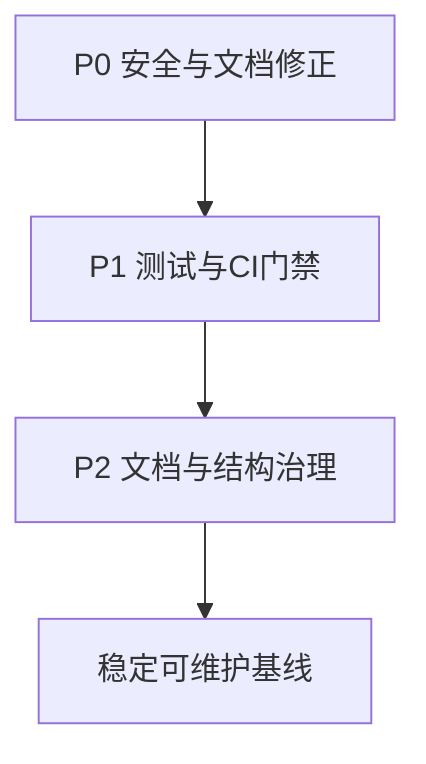

# 全文件夹优化方案

## 优化目标

- 降低凭据泄露与运行失败风险。
- 建立最小可持续工程基线（测试、lint、CI 校验、依赖可复现）。
- 统一文档与代码行为，减少“文档说法”和“实际实现”偏差。
- 在不重构业务逻辑的前提下，提升后续迭代效率。

## 现状要点（已梳理）

- 项目为 Python 单仓脚本式结构，核心流程清晰（采集 -> 处理 -> 摘要 -> 邮件 -> 归档）。
- 存在凭据暴露风险点：`test_config.py` 直接打印完整 key，本地 `.env` 含真实密钥。
- 工程质量缺口明显：无自动化测试、无 lint/format、CI 未做 PR 校验。
- 文档存在过时和不一致：README/分析文档部分内容与当前代码不符，且 README 引用了不存在的 LICENSE。

## 关键文件范围

- 入口与流程：[d:/cursor file/main.py](d:/cursor%20file/main.py)、[d:/cursor file/processing.py](d:/cursor%20file/processing.py)
- 配置与依赖：[d:/cursor file/config.py](d:/cursor%20file/config.py)、[d:/cursor file/requirements.txt](d:/cursor%20file/requirements.txt)、[d:/cursor file/.env.example](d:/cursor%20file/.env.example)
- 自动化与部署：[d:/cursor file/.github/workflows/daily-digest.yml](d:/cursor%20file/.github/workflows/daily-digest.yml)、[d:/cursor file/DEPLOY.md](d:/cursor%20file/DEPLOY.md)
- 文档与调试脚本：[d:/cursor file/README.md](d:/cursor%20file/README.md)、[d:/cursor file/collection_analysis.md](d:/cursor%20file/collection_analysis.md)、[d:/cursor file/test_config.py](d:/cursor%20file/test_config.py)、[d:/cursor file/debug_llm.py](d:/cursor%20file/debug_llm.py)

## 分阶段实施

### P0（先做，1 天内）安全与文档一致性

- 将 `test_config.py` 改为仅输出“是否配置”，禁止打印完整密钥。
- 审核 `.env` 历史提交风险（若曾泄露，执行密钥轮换）。
- 修正 README 中与当前实现不一致的内容（尤其“数量限制如何调整”）。
- 新增 `LICENSE`（README 已声明 MIT 时必须补齐）。

### P1（本周）质量门禁与可复现运行

- 引入 `pytest`，先覆盖 `config`、`processing`、`models` 的核心单元测试。
- 在 workflow 增加 `pull_request` 触发 + `pytest` 步骤，防止问题直接合入。
- 引入统一静态检查与格式化（建议 `ruff`），并提供最小配置。
- 补充开发依赖文件（如 `requirements-dev.txt`）并固定基础工具版本。

### P2（下周）结构治理与长期维护

- 建立 `docs/`，迁移并重写 `collection_analysis.md`，明确它是“实现说明”。
- 统一 README 与 DEPLOY 的边界：README 讲“快速上手+索引”，DEPLOY 讲“环境部署细节”。
- 整理调试脚本归位（如 `scripts/`），避免与生产入口同层混放。
- 增加文档维护机制（PR 检查项：代码改动是否同步文档）。

## 执行顺序图

## 验收标准

- 不再有任何脚本输出完整敏感信息。
- PR 阶段能自动完成依赖安装、测试、lint（至少测试+lint 二选二全部通过）。
- README/DEPLOY/实现文档三者描述一致，且 LICENSE 存在。
- 新成员按 README 最短路径可在 30 分钟内完成一次 `--run-once` 成功执行。

