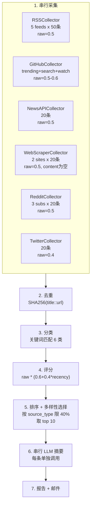
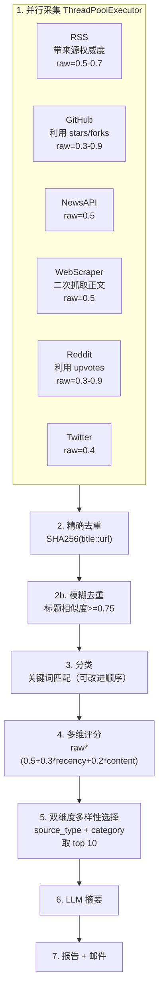

# 新闻采集与评分选择流程优化方案

## 当前流程梳理




### 核心数据路径

- **采集**: 6 个 Collector 串行执行 ([collectors.py](d:/cursor%20file/collectors.py) L63-70)
- **去重**: `deduplicate()` 基于 `SHA256(title::url)` ([processing.py](d:/cursor%20file/processing.py) L11-21)
- **分类**: `classify()` 纯关键词匹配，顺序短路 ([processing.py](d:/cursor%20file/processing.py) L24-53)
- **评分**: `score()` 公式 `raw_score * (0.6 + 0.4 * recency_factor)` ([processing.py](d:/cursor%20file/processing.py) L56-80)
- **选择**: `select_diverse_items()` 仅按 `source_type` 限额 ([processing.py](d:/cursor%20file/processing.py) L83-103)
- **摘要**: 串行逐条调用 LLM ([main.py](d:/cursor%20file/main.py) L90-97)

---

## 发现的 7 个关键问题

### 问题 1: raw_score 几乎无区分度

当前几乎所有 Collector 都设置 `raw_score = 0.5`（除 Twitter 0.4、GitHub Releases 0.6）。这意味着评分公式实际退化为**纯时间排序**，新鲜的低质量内容会排在稍旧的高质量内容前面。

具体 raw_score 分布：


| Collector       | raw_score | 备注                   |
| --------------- | --------- | -------------------- |
| RSS             | 0.5       | 不区分 arXiv 论文与普通新闻    |
| GitHub Trending | 0.5       | 不使用 star 数           |
| GitHub Search   | 0.5       | 不使用 star/fork 数      |
| GitHub Releases | 0.6       | 唯一有微小区分              |
| NewsAPI         | 0.5       | 全部相同                 |
| WebScraper      | 0.5       | 全部相同且 content 为空     |
| Reddit          | 0.5       | 丢弃了 upvotes/comments |
| Twitter         | 0.4       | 全部相同                 |


### 问题 2: 社交热度信号被丢弃

Reddit API 返回的 `score`(upvotes)、`num_comments` 完全未使用；GitHub API 返回的 `stargazers_count`、`forks_count` 完全未使用。这些是衡量内容质量的强信号。

### 问题 3: 采集串行执行

6 个 Collector 全部串行执行（[main.py](d:/cursor%20file/main.py) L63-70），每个都有网络 IO 等待。总耗时 = 所有 Collector 耗时之和，可能需要几十秒到数分钟。

### 问题 4: 去重覆盖面过窄

`SHA256(title::url)` 只能去除完全相同的条目。同一新闻从不同来源采集（如同一 AI 事件同时出现在 RSS、NewsAPI、Reddit）时标题和 URL 不同，无法去重。

### 问题 5: 分类器顺序短路导致误分类

`classify()` 按固定顺序匹配关键词，命中第一个就返回。例如一个 GitHub 开源项目的描述中如果包含 "paper"，会被归入"论文与研究"而非"开源项目"。

### 问题 6: 多样性选择忽略内容类别

`select_diverse_items()` 仅按 `source_type`（rss/github/reddit 等）做配额限制。最终 10 条可能全是同一类别（如全是"开源项目"），只要它们来自不同 source_type。

### 问题 7: WebScraper 采集内容为空

[collectors.py](d:/cursor%20file/collectors.py) L283 设置 `content=""`，导致这些条目无法被正确分类，LLM 摘要也只能依赖标题。

---

## 优化方案

### 优化 1: 利用社交信号重构 raw_score（影响最大）

在 [collectors.py](d:/cursor%20file/collectors.py) 中，让各 Collector 根据可获取的热度信号动态计算 raw_score，而不是写死常量。

**Reddit** (L317-328): 利用 `post["score"]` 和 `post["num_comments"]`

```python
upvotes = post.get("score", 0)
comments = post.get("num_comments", 0)
# 对数归一化到 0.3-0.9 范围
raw = min(0.9, 0.3 + 0.15 * math.log1p(upvotes / 50) + 0.1 * math.log1p(comments / 10))
```

**GitHub Search** (L160-172): 利用 `repo["stargazers_count"]`

```python
stars = repo.get("stargazers_count", 0)
raw = min(0.9, 0.3 + 0.2 * math.log1p(stars / 100))
```

**GitHub Trending** (L119-143): 解析页面上的 star 增量数

**RSS**: 区分来源权威度（arXiv > 一般博客）

```python
source_authority = {"arXiv cs.AI": 0.7, "arXiv cs.LG": 0.7, "MIT Tech Review AI": 0.65, ...}
raw_score = source_authority.get(src["name"], 0.5)
```

### 优化 2: 并行采集

将 [main.py](d:/cursor%20file/main.py) L63-70 的串行循环改为 `concurrent.futures.ThreadPoolExecutor` 并行：

```python
from concurrent.futures import ThreadPoolExecutor, as_completed

items: list[NewsItem] = []
with ThreadPoolExecutor(max_workers=6) as executor:
    futures = {executor.submit(c.collect): c for c in collectors}
    for future in as_completed(futures):
        collector = futures[future]
        try:
            collected = future.result(timeout=60)
            items.extend(collected)
            logging.info(f"{collector.__class__.__name__} collected {len(collected)} items")
        except Exception as e:
            logging.error(f"{collector.__class__.__name__} failed: {e}")
```

### 优化 3: 增强去重 -- 标题相似度

在现有精确去重之后，增加一轮基于标题编辑距离的模糊去重：

```python
from difflib import SequenceMatcher

def deduplicate_fuzzy(items: list[NewsItem], threshold: float = 0.75) -> list[NewsItem]:
    unique: list[NewsItem] = []
    for item in items:
        is_dup = False
        for existing in unique:
            ratio = SequenceMatcher(None, item.title.lower(), existing.title.lower()).ratio()
            if ratio >= threshold:
                # 保留 raw_score 更高的那个
                if item.raw_score > existing.raw_score:
                    unique.remove(existing)
                    unique.append(item)
                is_dup = True
                break
        if not is_dup:
            unique.append(item)
    return unique
```

### 优化 4: 改进评分公式 -- 多维度加权

将评分从单一的 `raw_score * 时效性` 改为多维度综合评分：

```python
def score(item: NewsItem) -> float:
    recency_factor = max(0.3, 1.0 - (age_hours / 72))
    
    # 内容完整度奖励：有实际内容 > 只有标题
    content_factor = 1.0 if len(item.content) > 100 else 0.7
    
    # 综合评分
    final = item.raw_score * (
        0.5                           # 基础权重
        + 0.3 * recency_factor        # 时效性权重
        + 0.2 * content_factor        # 内容完整度权重
    )
    return round(final, 3)
```

### 优化 5: 双维度多样性选择 -- source_type + category

在 `select_diverse_items()` 中同时限制来源和类别：

```python
def select_diverse_items(items: list[NewsItem], max_count: int = 10) -> list[NewsItem]:
    sorted_items = sorted(items, key=lambda x: x.score, reverse=True)
    max_per_source = max(2, int(max_count * 0.4))
    max_per_category = max(2, int(max_count * 0.35))  # 新增
    
    source_counts: dict[str, int] = defaultdict(int)
    category_counts: dict[str, int] = defaultdict(int)  # 新增
    selected: list[NewsItem] = []
    
    for item in sorted_items:
        if len(selected) >= max_count:
            break
        source_ok = source_counts[item.source_type] < max_per_source
        category_ok = category_counts[item.category or "其他"] < max_per_category  # 新增
        if source_ok and category_ok:
            selected.append(item)
            source_counts[item.source_type] += 1
            category_counts[item.category or "其他"] += 1
    
    # 如果因限制太严导致不够，放宽再补
    if len(selected) < max_count:
        for item in sorted_items:
            if item not in selected and len(selected) < max_count:
                selected.append(item)
    
    return selected
```

### 优化 6: WebScraper 增加正文抓取

在 [collectors.py](d:/cursor%20file/collectors.py) `WebScraperCollector.collect()` 中，对采集到的链接做二次请求抓取摘要正文：

```python
# 在创建 item 后，尝试抓取正文
try:
    detail_resp = httpx.get(href, timeout=10)
    if detail_resp.status_code == 200:
        detail_soup = BeautifulSoup(detail_resp.text, "html.parser")
        paragraphs = detail_soup.select("p")
        content = " ".join(p.get_text(strip=True) for p in paragraphs[:5])
except Exception:
    content = ""
```

### 优化 7: 提取公共 fingerprint 方法

将 6 个 Collector 中完全相同的 `_fingerprint()` 方法提取到 `BaseCollector`：

```python
class BaseCollector:
    source_type: str = "base"

    def collect(self) -> list[NewsItem]:
        raise NotImplementedError

    @staticmethod
    def _fingerprint(item: NewsItem) -> str:
        base = f"{item.title}::{item.url}"
        return hashlib.sha256(base.encode("utf-8")).hexdigest()
```

---

## 优化后的流程




## 影响与收益评估


| 优化项            | 影响面           | 收益                | 复杂度 |
| -------------- | ------------- | ----------------- | --- |
| 社交信号 raw_score | collectors.py | 评分区分度从几乎为0提升到有效区分 | 中   |
| 并行采集           | main.py       | 采集耗时降低约 50-70%    | 低   |
| 模糊去重           | processing.py | 减少跨源重复，提高输出多样性    | 低   |
| 多维评分           | processing.py | 评分更合理，避免纯时间排序     | 低   |
| 双维度多样性         | processing.py | 类别更均衡，避免同类别霸榜     | 低   |
| WebScraper 正文  | collectors.py | 分类和摘要质量提升         | 中   |
| 提取公共方法         | collectors.py | 消除重复代码，降低维护成本     | 低   |


## 涉及文件

- [collectors.py](d:/cursor%20file/collectors.py): 优化 1, 2, 6, 7
- [processing.py](d:/cursor%20file/processing.py): 优化 3, 4, 5
- [main.py](d:/cursor%20file/main.py): 优化 2
- [tests/test_processing.py](d:/cursor%20file/tests/test_processing.py): 同步更新测试

